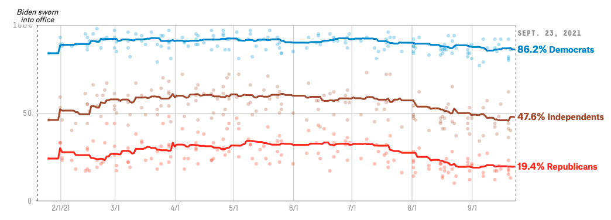

# Plot to reproduce


# Brief Intro
The plot I am trying to reproduce is about public's approval to President Biden's response to Covid 19 since his inauguration. 
[Link to this plot](https://projects.fivethirtyeight.com/coronavirus-polls/)
[Link to the dataset](https://github.com/fivethirtyeight/covid-19-polls/archive/master.zip)

# My reproduced Plot
There are 2 main issues I have not figured out yet. One is they put data into 3 separate csv files. I only read in the data they used to mark the trendline. I am not quite sure if I can import another cvs file, read the data in and then plot them within the same plot. The other main issue is my x-axis labling. I am still trying to figure out how to make it look the same as it should be.

```{r cars}
library(tidyverse)

raw_data <- read.csv("data/covid_approval_polls_adjusted.csv")
raw_data = filter(raw_data,subject=="Biden")
raw_data_all_party = filter(raw_data,party=="D" | party=="R" | party=="I")

data <- read.csv("data/covid_approval_toplines.csv")
data = filter(data,subject=="Biden")
data_all_party = filter(data,party=="D" | party=="R" | party=="I")
color_group <- c("blue","brown","red")


ggplot(data=data_all_party, aes(x = as.Date(modeldate,"%m/%d/%Y"), y = approve_estimate)) +   geom_point(data=data_all_party, aes(color=party),shape=20,size=1,alpha=0.5) + 
scale_colour_manual(values=color_group)+
xlab("") + ylab("") +
scale_x_date(date_labels = "%m/%d",breaks = "1 month") +  
geom_line(data=data_all_party, aes(x = as.Date(modeldate,"%m/%d/%Y"), y = approve_estimate, color=party)) + 
theme(aspect.ratio=1/3,panel.background = element_rect(fill = "white",colour = "white",size = 0.5, linetype = "solid"),
panel.grid.major = element_line(size = 0.1, linetype = 'solid',colour = "gray"), 
panel.grid.minor = element_blank(),
legend.position = "none") + 
scale_y_continuous(limits= c(0, 100), breaks=c(0, 50, 100), labels=c("0", "50", "100%")) +
annotate(geom="text",x=as.Date("2021-10-10"), y=30,label="19.4% Republicans",fontface="bold", color="red") + 
annotate(geom="text",x=as.Date("2021-10-10"), y=90,label="86.2% Democrats",fontface="bold", color="blue") + 
annotate(geom="text",x=as.Date("2021-10-10"), y=50,label="47.6% Independents",fontface="bold", color="brown") +
geom_point(data=raw_data_all_party, aes(x = as.Date(enddate,"%m/%d/%Y"), y = approve_adjusted, color=party),shape=20,size=1,alpha=0.2) 

#raw_data_all_party %>% 
  #ggplot(mapping = aes(x = as.Date(enddate,"%m/%d/%Y"), y = approve_adjusted)) + geom_step()

```


